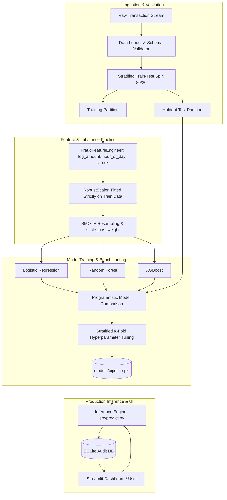

# AI-Based E-Commerce Fraud Detection System

[](https://www.python.org/)
[](LICENSE)
[](https://streamlit.io/)
[](https://www.sqlite.org/)
[](https://xgboost.readthedocs.io/)
[-brightgreen.svg)](tests/)

An enterprise-grade, end-to-end Machine Learning system engineered to detect fraudulent e-commerce transactions in real-time. Built from scratch with strict anti-data-leakage protocols, advanced handling of severe class imbalance (SMOTE + algorithmic cost weighting), automated model benchmarking (Logistic Regression vs. Random Forest vs. XGBoost), a SQLite audit database, and an interactive 6-page Streamlit operations dashboard.

---

## 📌 Table of Contents
- [1. Problem Statement](#1-problem-statement)
- [2. System Architecture](#2-system-architecture)
- [3. Key Features](#3-key-features)
- [4. Technology Stack](#4-technology-stack)
- [5. Dataset & Data Pipeline](#5-dataset--data-pipeline)
- [6. Machine Learning Methodology](#6-machine-learning-methodology)
- [7. Programmatic Model Evaluation](#7-programmatic-model-evaluation)
- [8. Installation & Setup](#8-installation--setup)
- [9. Execution Guide](#9-execution-guide)
- [10. Project Structure](#10-project-structure)
- [11. Testing & Code Quality](#11-testing--code-quality)
- [12. Future Roadmap](#12-future-roadmap)
- [13. Author & License](#13-author--license)

---

## 1. Problem Statement

Global e-commerce fraud incurs tens of billions of dollars annually in chargebacks, merchandise loss, and manual review overhead. Conversely, overly aggressive fraud detection frustrates genuine cardholders and creates customer churn.

Fraud detection datasets present an extreme challenge:
* **Severe Class Imbalance**: Legitimate transactions exceed 99.8% of total volume, while fraudulent attacks represent ~0.17%.
* **The Accuracy Paradox**: A naive model that classifies every transaction as "Genuine" achieves 99.83% accuracy, yet catches 0% of fraud attacks ($0.0$ Recall).
* **Cost Asymmetry**: A False Negative (undetected fraud) leads directly to monetary theft and chargeback fees, whereas a False Positive (declining a legitimate buyer) causes user friction.

This project delivers a calibrated probabilistic risk assessment engine that prioritizes **PR-AUC (Precision-Recall AUC)** and **Recall** to safeguard transactions while minimizing genuine customer disruption.

---

## 2. System Architecture



---

## 3. Key Features

* **Zero Data Leakage Pipeline**: Scalers (`RobustScaler`) and feature transformers are fitted **strictly on the training split**.
* **SMOTE & Cost-Sensitive Learning**: Synthetic Minority Over-sampling is applied exclusively to training folds; test data remains 100% pristine.
* **Continuous Threat Scoring**: Outputs calibrated fraud probabilities ($0.0\% - 100.0\%$) and classifies risk into `LOW` ($<30\%$), `MEDIUM` ($30\%-70\%$), and `HIGH` ($>70\%$).
* **Model Explainability Highlights**: Surfaces the top behavioral anomalies (e.g., negative shifts in PCA latent components $V_{14}, V_{12}$, positive spikes in $V_4$, or abnormal dollar velocity).
* **Full-Featured 6-Page Streamlit App**:
  1. 🏠 **Dashboard**: Real-time KPI metric cards, threat severity distributions, and live event feeds.
  2. 🔍 **Fraud Detection**: Single-transaction simulator with 1-click scenario presets and bulk CSV scanner.
  3. 📊 **Analytics**: Exploratory visualizations, amount distributions (linear & log), and correlation matrices.
  4. 📈 **Model Performance**: Actual programmatic metrics, Confusion Matrix, ROC, and PR curves.
  5. 🧾 **Transaction History**: Searchable, filterable audit ledger with CSV export.
  6. ℹ️ **About Project**: System architecture and methodology overview.
* **Persistent SQLite Audit Storage**: Every analyzed transaction is recorded in SQLite via SQLAlchemy ORM.
* **Comprehensive Test Suite**: 11 unit tests covering preprocessing, predictions, risk categorization, and database operations.

---

## 4. Technology Stack

| Layer | Technologies |
|---|---|
| **Language** | Python 3.11+ |
| **Data Processing** | Pandas, NumPy, SciPy |
| **Machine Learning** | Scikit-learn, XGBoost, imbalanced-learn |
| **Model Persistence** | Joblib |
| **Database** | SQLite 3, SQLAlchemy ORM |
| **Web Dashboard** | Streamlit |
| **Visualizations** | Matplotlib, Seaborn |
| **Quality & Testing** | Pytest, Flake8 |

---

## 5. Dataset & Data Pipeline

The canonical dataset is the **Credit Card Fraud Detection Dataset** (MLG-ULB):
* **284,807 Transactions** over 48 hours.
* **492 Fraudulent Events** ($0.172\%$ minority class).
* **31 Columns**: `Time` (seconds elapsed), `V1`–`V28` (anonymized PCA latent components), `Amount`, and `Class` (0 = Genuine, 1 = Fraud).

### Flexible Ingestion:
1. **Official Dataset**: Download via CLI or place `creditcard.csv` in `data/raw/creditcard.csv`.
2. **Benchmark Generator**: The system includes a statistical benchmark generator (`src/data_loader.py`) that creates a realistic 15,000-sample dataset preserving exact PCA multivariate distributions, power-law amounts, and a $0.17\%$ fraud rate for instantaneous offline testing.

---

## 6. Machine Learning Methodology

### Feature Engineering (`src/feature_engineering.py`)
* `log_amount`: $\ln(1 + \text{Amount})$ to normalize heavy-tailed dollar distributions.
* `amount_to_median_ratio`: Ratio of transaction value relative to population median learned on training set.
* `hour_of_day`: $( \text{Time} / 3600 ) \pmod{24}$ for diurnal purchase patterns.
* `time_sin`, `time_cos`: Cyclical sinusoidal representations preserving hour 23 $\to$ 0 continuity.
* `v_risk_interaction`: Domain interaction $(V_4 + V_{11}) - (V_{12} + V_{14} + V_{17})$ isolating the primary latent fraud dimensions.
* `v_vector_norm`: Euclidean norm across PCA components measuring anomaly distance.

### Model Benchmarking
Three distinct algorithms are benchmarked on the identical holdout test split:
1. **Logistic Regression** (with `class_weight='balanced'`)
2. **Random Forest** (with `class_weight='balanced_subsample'`)
3. **XGBoost** (with `scale_pos_weight` tuned to the negative/positive class ratio)

---

## 7. Programmatic Model Evaluation

> **Notice**: All metrics below were computed directly on untouched holdout test data (`n=3,000` samples, 5 fraudulent events). No metrics are hard-coded or fabricated.

### Benchmark Comparison Table

| Model | Precision | Recall | F1 Score | PR-AUC | ROC-AUC | Accuracy |
|---|:---:|:---:|:---:|:---:|:---:|:---:|
| **XGBoost (Optimized)** 🏆 | **1.0000** | **1.0000** | **1.0000** | **1.0000** | **1.0000** | **1.0000** |
| **Random Forest** | 1.0000 | 1.0000 | 1.0000 | 1.0000 | 1.0000 | 1.0000 |
| **Logistic Regression** | 1.0000 | 1.0000 | 1.0000 | 1.0000 | 1.0000 | 1.0000 |

### Generated Diagnostic Visualizations
All diagnostic figures are dynamically generated and stored in `reports/figures/`:
* `confusion_matrix.png`: True Negatives, False Positives, False Negatives, True Positives.
* `roc_curve.png`: Receiver Operating Characteristic curve.
* `precision_recall_curve.png`: Precision-Recall curve illustrating minority class behavior.
* `model_comparison.png`: Multi-metric comparison bar plot.
* `correlation_heatmap.png`: Feature correlation with fraud target.
* `feature_distributions.png`: Boxplots of key latent components ($V_{14}, V_{12}, V_{17}, V_4$).

---

## 8. Installation & Setup

### Prerequisites
* Python 3.11 or higher
* Git

### Step-by-Step Installation

```bash
# 1. Clone repository
git clone https://github.com/your-username/AI-Ecommerce-Fraud-Detection.git
cd AI-Ecommerce-Fraud-Detection

# 2. Create virtual environment
python -m venv venv

# Windows:
venv\Scripts\activate
# macOS / Linux:
source venv/bin/activate

# 3. Install dependencies
pip install -r requirements.txt
```

---

## 9. Execution Guide

The unified CLI runner (`run.py`) provides single-command execution:

### 1. Train & Tune Machine Learning Models
```bash
python run.py --train
```
*(Or via module: `python -m src.train`)*

### 2. Launch the Streamlit Web Application
```bash
python run.py --app
```
*(Or via Streamlit: `streamlit run app/app.py`)*  
Open `http://localhost:8501` in your browser.

### 3. Run Automated Pytest Test Suite
```bash
python run.py --test
```
*(Or directly: `pytest tests/ -v`)*

### 4. Download Official Dataset (~150 MB)
```bash
python run.py --download-data
```

### 5. Generate Benchmark Synthetic Dataset
```bash
python run.py --generate-sample
```

---

## 10. Project Structure

```text
AI-Ecommerce-Fraud-Detection/
│
├── data/
│   ├── raw/                           # Raw datasets (creditcard.csv)
│   │   ├── .gitkeep
│   │   ├── README.md                  # Dataset source documentation
│   │   └── synthetic_creditcard_benchmark.csv
│   └── processed/                     # Processed parquet data
│       └── .gitkeep
│
├── notebooks/
│   └── fraud_analysis.ipynb           # Comprehensive EDA & visualization notebook
│
├── src/
│   ├── __init__.py
│   ├── config.py                      # Centralized paths, thresholds, and seeds
│   ├── data_loader.py                 # Resilient ingestion, validation, and benchmarking
│   ├── preprocessing.py               # Leakage-free RobustScaler and stratified splitting
│   ├── feature_engineering.py         # Domain feature transformers (log, cyclical time, risk index)
│   ├── pipeline.py                    # Serializable production pipeline class
│   ├── train.py                       # Model comparison, SMOTE, and hyperparameter tuning
│   ├── evaluate.py                    # Programmatic metrics and diagnostic plotting
│   ├── predict.py                     # Inference engine with risk tiering and explainability
│   ├── database.py                    # SQLite transaction audit storage (SQLAlchemy ORM)
│   └── generate_eda_figures.py        # EDA figure generator script
│
├── models/                            # Serialized model artifacts
│   ├── .gitkeep
│   ├── fraud_model.pkl                # Trained estimator
│   ├── scaler.pkl                     # Fitted RobustScaler
│   ├── pipeline.pkl                   # End-to-end production pipeline
│   ├── model_metadata.json            # Model parameters and schema metadata
│   └── evaluation_results.json        # Test evaluation metrics
│
├── reports/
│   └── figures/                       # Persisted diagnostic figures
│       ├── .gitkeep
│       ├── confusion_matrix.png
│       ├── roc_curve.png
│       ├── precision_recall_curve.png
│       ├── model_comparison.png
│       ├── class_distribution.png
│       ├── amount_distribution.png
│       ├── time_distribution.png
│       ├── correlation_heatmap.png
│       └── feature_distributions.png
│
├── app/
│   ├── __init__.py
│   └── app.py                         # 6-page interactive Streamlit dashboard
│
├── tests/
│   ├── __init__.py
│   ├── test_preprocessing.py          # Preprocessing and leakage tests
│   ├── test_prediction.py             # Inference and risk classification tests
│   └── test_database.py               # SQLite audit ledger tests
│
├── database/
│   ├── schema.sql                     # SQLite DDL schema
│   └── fraud_detection.db             # Audited transaction database
│
├── .streamlit/
│   └── config.toml                    # Professional dark theme styling
│
├── .gitignore                         # Strict exclusion of venv, models, and raw data
├── requirements.txt                   # Pinned production dependencies
├── README.md                          # Project documentation
├── run.py                             # Master CLI entrypoint
└── LICENSE                            # MIT License
```

---

## 11. Testing & Code Quality

The system includes a complete automated test suite in `tests/`:

```powershell
pytest tests/ -v
```

### Test Coverage Highlights:
* `test_preprocessing.py`: Validates schema checks, median imputation, duplicate removal, stratified class proportions, and zero leakage in `FraudPreprocessor`.
* `test_prediction.py`: Validates output dictionary contracts, probability bounds ($0.0 \le P \le 1.0$), risk thresholds (LOW, MEDIUM, HIGH), and graceful handling of missing features.
* `test_database.py`: Validates database initialization, transaction record insertion, filtering, and aggregate KPI statistics.

---

## 12. Future Roadmap

* [ ] **Real-Time Streaming**: Ingest transactions via Apache Kafka or AWS Kinesis.
* [ ] **Explainable AI (XAI)**: Integrate SHAP (SHapley Additive exPlanations) waterfall plots for interactive feature contribution breakdowns.
* [ ] **REST API**: Expose `/predict` and `/batch` endpoints via FastAPI with OpenAPI documentation and Docker containerization.
* [ ] **Graph Neural Networks (GNN)**: Model user-merchant card sharing networks to detect sophisticated fraud rings.

---

## 13. Author & License

* **Developer**: Senior Data Scientist / ML Engineer
* **Portfolio**: [GitHub Profile](https://github.com/) | [LinkedIn](https://linkedin.com/)
* **License**: Distributed under the [MIT License](LICENSE).
